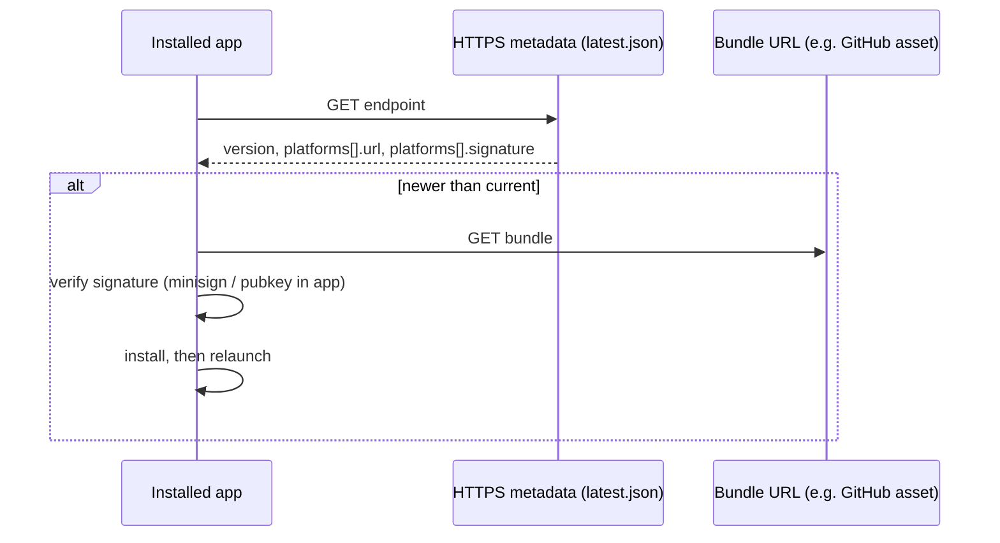

# LeFocus: App updates (Tauri updater)

**Status:** Implemented  
**Stack:** Tauri 2, `@tauri-apps/plugin-updater`, `@tauri-apps/plugin-process`

---

## Purpose

Describe how shipped desktop builds discover, verify, and install newer versions over HTTPS, without relying on the Mac App Store. This is the **direct-download / GitHub Releases** path.

---

## High-level flow

1. **Build:** Release builds produce signed update artifacts (`createUpdaterArtifacts`) and embed a **public key** + **update endpoint URL(s)** in the app (`tauri.conf.json`).
2. **Publish:** You upload binaries (e.g. `.app.tar.gz`) and a **`latest.json`** (name must match the URL you configure) that lists semver, per-platform `url` + `signature` (contents of the `.sig` file).
3. **Runtime:** The app calls `check()` → optional `downloadAndInstall()` → `relaunch()`. The plugin verifies the bundle with the embedded pubkey before install.

---

## Components

| Piece | Role |
|--------|------|
| `tauri.conf.json` → `plugins.updater` | `pubkey`, `endpoints` (TLS in production). |
| `bundle.createUpdaterArtifacts` | Emits updater bundles + `.sig` next to normal installers. |
| `TAURI_SIGNING_PRIVATE_KEY` | Env at **build** time; signs artifacts. Never commit; backup safely. |
| `latest.json` | Hosted static JSON (e.g. GitHub Release asset). Tauri validates structure + semver. |
| Frontend | Settings → “check for updates”: `check()`, `downloadAndInstall()`, `relaunch()`. |
| Capabilities | `updater:default`, `process:default` (`src-tauri/capabilities/desktop.json`). |

---

## Security model

- HTTPS alone is **not** the trust boundary; the **signature** is.
- The app embeds only the **public** key; updates must be signed with the matching **private** key or install fails.
- Losing the private key means you cannot ship trusted updates to existing installs (users would need a fresh install with a new keypair—operationally painful).

---

## Operator checklist (each release)

1. Bump app version in `src-tauri/tauri.conf.json` (and keep `package.json` aligned if you use it for tagging).
2. Export `TAURI_SIGNING_PRIVATE_KEY` (and password if used); run `tauri build`.
3. Collect bundles + `.sig` from `src-tauri/target/release/bundle/…`.
4. Build **`latest.json`** per [Tauri static JSON](https://v2.tauri.app/plugin/updater/) (e.g. `darwin-aarch64`, `darwin-x86_64`, …): each entry needs `url` + full `signature` text from the matching `.sig`.
5. Upload assets + `latest.json` to the URL configured in `endpoints` (common pattern: `…/releases/latest/download/latest.json` on GitHub).

---

## Code / config touchpoints

- Plugins registered in `src-tauri/src/lib.rs` (`tauri_plugin_updater`, `tauri_plugin_process`).
- UI: `src/components/profile/SettingsSettingsPage.tsx` (updates section).
- Endpoint placeholder: replace `YOUR_GITHUB_USER` / `YOUR_REPO` in `tauri.conf.json` with the real release location.

---

## Non-goals / limits

- **Auto-check on launch** is not required for correctness; can be added later (startup `check()` with quiet UX).
- **Dev / `tauri dev`** is not the same as a signed production updater; validate with release builds.
- **Store distribution** (Mac App Store, etc.) uses store updates instead of this pipeline.
