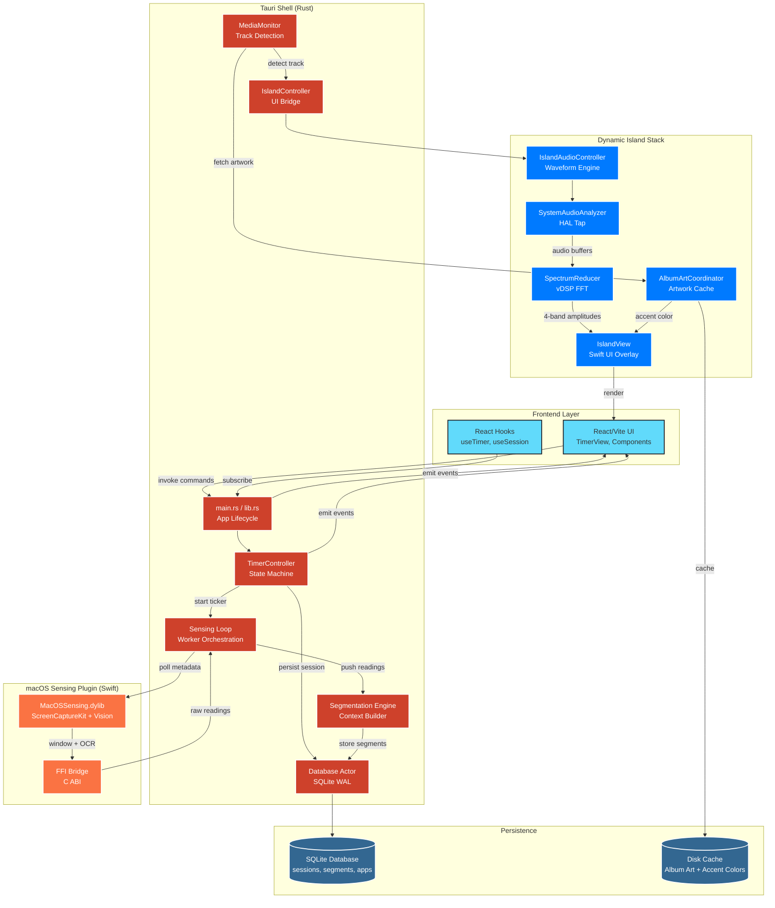

# LeFocus Architecture Brief (LLM-Friendly)

This document condenses the full repository architecture into a shape that downstream LLMs can consume to auto-generate diagrams or reason about integrations. Keep descriptions declarative, name concrete files/modules, and highlight the edges between subsystems.

---

## 1. High-Level Topology

```
React/Vite Frontend  ⇄  Tauri (Rust) shell  ⇄  SQLite (actor thread)
                         │
                         └─ macOS Sensing Plugin (Swift dylib via FFI)

Dynamic Island stack (SwiftUI-like macOS overlay) consumes timer/audio data via MediaMonitor.
```

- **Runtime surface** lives in `/src` (React) and `src-tauri/` (Rust + Tauri). The UI calls Rust commands through `@tauri-apps/api/tauri`.
- **Sensing + segmentation pipeline** runs inside `src-tauri/plugins/macos-sensing` (Swift Package) plus Rust orchestration.
- **Island audio/visualization** code spans `src-tauri/src/island/**` (Rust controllers) and Swift/macOS components for overlay rendering.
- **Persistent state** is SQLite (WAL mode) managed by a dedicated actor thread so async callers never block the UI thread.

---

## 2. Runtime Components

| Layer                                 | Key Modules                                                                        | Responsibilities                                                                                                                                                                                |
| ------------------------------------- | ---------------------------------------------------------------------------------- | ----------------------------------------------------------------------------------------------------------------------------------------------------------------------------------------------- |
| **Frontend (React + Vite)**           | `src/App.tsx`, `src/components/Timer*`, `src/hooks/useTimer*`                      | Render timer/UI states, invoke Tauri commands (`start_timer`, `end_timer`, `cancel_timer`, `get_timer_state`), react to events (`timer-state-changed`, `timer-heartbeat`, `session-completed`). |
| **Tauri Shell (Rust)**                | `src-tauri/src/main.rs`, `lib.rs`, `timer/`, `db/`, `audio/`, `island/`            | Owns app lifecycle, timer state machine, DB actor, audio/noise engines, MediaMonitor bridge, and IPC event emission.                                                                            |
| **Database Actor**                    | `src-tauri/src/db/mod.rs`, `migrations.rs`                                         | Runs on dedicated thread, executes SQL via closures, handles WAL, migrations (v1–v3), crash recovery (marks interrupted sessions).                                                              |
| **MacOSSensing Plugin (Swift dylib)** | `src-tauri/plugins/macos-sensing/Sources/**`, `CMacOSSensing` shim                 | Captures window metadata/screenshots (ScreenCaptureKit), runs OCR (Vision), funnels results through C ABI into Rust.                                                                            |
| **Segmentation + Context Engine**     | `system-design/phase-3-4 docs`, `src-tauri/src/sensing/**` (loop_worker, reducers) | Polls sensing data, deduplicates via pHash, applies hysteresis segmentation to build segments.                                                                                                  |
| **Media / Island Stack**              | `system-design/phase-5.* docs`, `src-tauri/src/island/**`, Swift UI overlay        | Integrates Apple Music APIs, album art fetching, waveforms, and renders Dynamic Island-inspired UI with real-time audio tinting.                                                                |

---

## 3. Data Pathways

### 3.1 Timer & Session Lifecycle

1. `TimerView` calls `invoke("start_timer", target_ms)`.
2. `TimerController` (Rust) persists a session row (`status = Running`), spawns ticker task.
3. Every tick, controller updates `active_ms`, emits `timer-state-changed`; every N ticks it sends `timer-heartbeat` + DB progress update.
4. `end_timer` transitions session to `Completed`, cancels ticker, emits `session-completed` with `SessionInfo`.
5. Frontend hook updates UI and summary modal.

### 3.2 Sensing → Segmentation → Summary

1. When timer runs, `macos_sensing_get_active_window_metadata` polls bundle/title/bounds; screenshot + OCR executed via Swift plugin.
2. Rust `sensing_loop` pushes readings into bounded channels; workers compute perceptual hashes and textual cues.
3. `SegmentationEngine` applies confidence scoring, merges sandwiches, outputs ordered contexts with timestamps.
4. On session end, results stored alongside session ID for summary rendering (phase 4+ requirements).

### 3.3 Media + Island Audio Pipeline

1. `MediaMonitor` listens to Apple Music/Now Playing info, fetches album art via `AlbumArtCoordinator` (Phase 5.7).
2. `SystemAudioAnalyzer` taps HAL output; `SpectrumReducer` (Phase 5.8) creates 4-band amplitudes.
3. `IslandAudioController` feeds `[CGFloat]` bars + accent color to `IslandView` rendering compact/expanded waveform.
4. Fallback `WaveformAnimator` keeps UI alive if analyzer fails; accent colors cached per track.

---

## 4. Persistence & Messaging

- **SQLite schema**: `sessions` table dominates P0, later phases add `segments`, `apps`, `artifacts`. Migrations tracked via `PRAGMA user_version`.
- **Actor API**: Rust code calls `db.execute(|conn| { ... })`; closure runs on DB thread, response delivered through oneshot channel.
- **Events**: Tauri emits to frontend; internally, async channels connect sensing workers, and Combine-style callbacks connect media/analyzer outputs to UI.
- **Caching**: Album artwork + accent metadata cached on disk; waveform analyzer state maintained in-memory.

---

## 5. Key Files & Structures (quick reference)

| Concept              | Struct / File                                                                                                            |
| -------------------- | ------------------------------------------------------------------------------------------------------------------------ |
| Timer state snapshot | `src-tauri/src/timer/state.rs::TimerState` (fields: `status`, `target_ms`, `active_ms`, `started_at`, `running_anchor`). |
| Session info return  | `src-tauri/src/models/session.rs::SessionInfo`.                                                                          |
| DB handle            | `src-tauri/src/db/mod.rs::Database` plus `execute` API.                                                                  |
| FFI types            | `src-tauri/plugins/macos-sensing/Sources/MacOSSensing/FFITypes.swift`, mirrored in `macos_bridge.rs`.                    |
| Media track info     | `TrackInfo { title, artist, artworkURL, accentColor }` (Phase 5.7 doc).                                                  |
| Waveform engine      | `WaveformEngine` composing `SystemAudioAnalyzer`, `SpectrumReducer`, `WaveformFallbackAnimator` (Phase 5.8).             |

---

## 6. End-to-End Sequence (Happy Path)

1. **Start Focus Block**

   - User selects preset in React UI; `start_timer` fires.
   - Rust controller persists session, starts ticker + sensing loop.

2. **During Session**

   - Ticker emits heartbeats; sensing plugin streams window/ocr data; segmentation builds context timeline.
   - MediaMonitor tracks current track; Dynamic Island shows timer/audio waveform tinted by album art.

3. **Session Completion**

   - Timer hits zero, auto-stops; `session-completed` event dispatches with summary payload.
   - React summary modal pulls segments + app icons (with background icon fetch fallbacks).

4. **Post-Session Review**
   - User sees stacked bar/timeline, context percentages, confidence, and optionally island visual persists until dismissed.

---

## 7. External Dependencies & Permissions

- **macOS Capabilities**: Screen Recording, Accessibility (for window metadata), potentially MusicKit or Now Playing APIs for track info.
- **Libraries**: Rust uses `tokio`, `tauri`, `rusqlite`, `serde`; Swift uses ScreenCaptureKit, Vision, CoreImage, Accelerate/vDSP.
- **Build Flow**: `src-tauri/build.rs` invokes Swift Package Manager, copies `libMacOSSensing.dylib` into Tauri resources before bundling.

---

## 8. Glossary (diagram hints)

- **TimerController** – central Rust service orchestrating session lifecycle and heartbeats.
- **Database Actor** – single-threaded SQLite executor ensuring serialized writes.
- **MacOSSensing Plugin** – Swift module delivering active window + OCR data via FFI.
- **Segmentation Engine** – Rust logic turning raw readings into focus contexts.
- **MediaMonitor** – Observes system audio/track metadata for Dynamic Island UI.
- **WaveformEngine** – Live audio FFT + fallback animator powering waveform bars.
- **TrackInfo** – Data object combining metadata, artwork, accent color for album experiences.
- **Events** – `timer-state-changed`, `timer-heartbeat`, `session-completed` propagate state to UI.

Use these named nodes and arrows (`Frontend UI → Tauri Command → TimerController → DB`, `TimerController → Heartbeat Event → Frontend`, `Sensing Plugin → FFI → Segmentation Engine → DB/Summary`) when prompting GPT for diagrams.

---

## 9. Future Hooks

- Add cross-session analytics by extending schema (`sessions_summary`, `activities`).
- Potential API endpoints (local-only) could expose summaries for integrations.
- Modularize sensing workers for alternative classifiers (e.g., ML window labeling) without touching frontend contracts.

This brief should stay under ~2–3k tokens so LLMs can ingest it as context and render architecture sketches quickly.

---

## 10. Architecture Diagram (Mermaid)



### Key Flows

**Timer Lifecycle:**

```
User Action → UI → TimerController → DB → Events → UI Update
```

**Sensing Pipeline:**

```
Timer Start → Sensing Loop → Swift Plugin → FFI → Segmentation → DB
```

**Media Pipeline:**

```
MediaMonitor → AlbumArtCoordinator → IslandAudioController → WaveformEngine → IslandView
```
